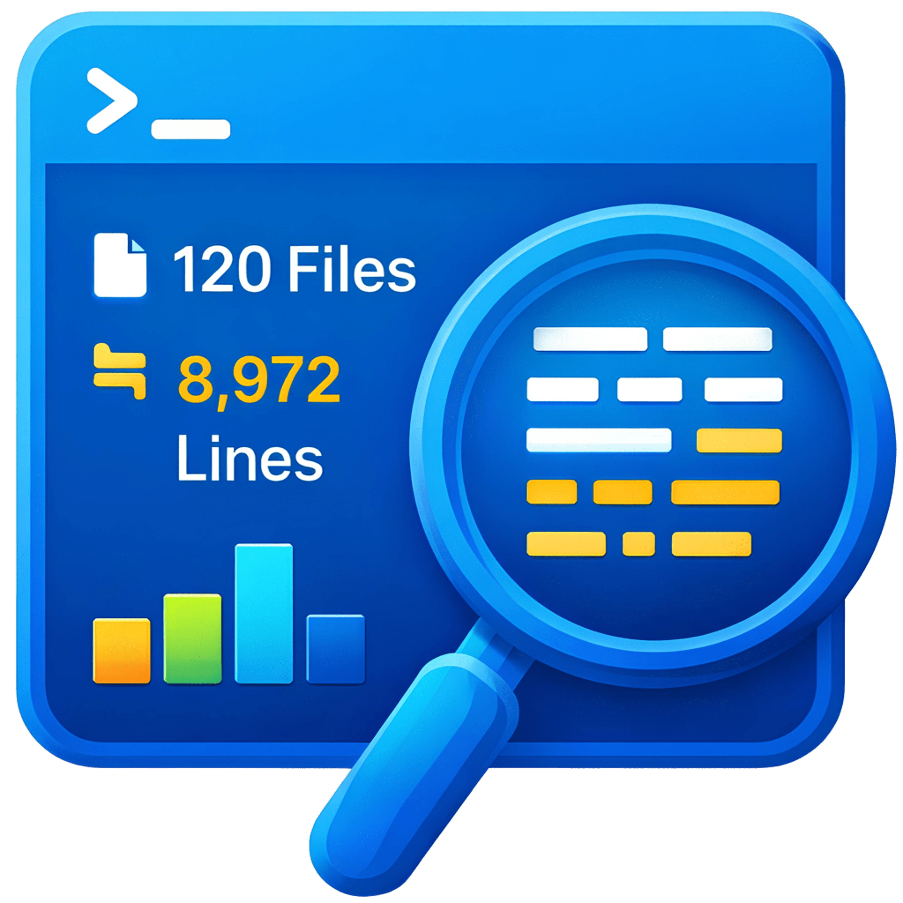

<div align="center">
  
  <h1 align="center">
    Locio
  </h1>

  <p align="center">
    Official documentation for <strong>Locio</strong> – a powerful CLI tool to count lines and files with rich filtering and statistics.
  </p>

  <p align="center">
    <a href="https://locio.js.org">📚 Documentation Site</a>
    ·
    <a href="https://github.com/kiron0/locio">💻 GitHub Repository</a>
    ·
    <a href="https://www.npmjs.com/package/locio">📦 npm Package</a>
  </p>
</div>

---

## 🚀 What is Locio?

Locio is a **fast, Rust-powered CLI** that helps you analyze your codebase by counting **files** and **lines of code** with powerful filters and rich statistics.

Key capabilities:

- **Recursive counting** of files and lines in directories
- **Interactive home page** when run without arguments
- **Flexible filtering** by patterns, extensions, directories, and file names
- **Multiple extensions** in a single run (e.g. `rs,ts,js`)
- **Size filtering** by minimum and maximum file size
- **Binary detection** to skip binary files automatically
- **Multiple output formats**: human-readable, JSON, CSV, TSV
- **Rich statistics** by extension and directory
 - **Exportable reports**: save results as `locio-report.{txt,json,csv,tsv}` with a single flag

---

## ⚙️ Installation

```bash
npm install -g locio
```

This installs the `locio` (and `lc`) CLI globally.

---

## 🏁 Your First Count

```bash
# Count files and lines in the current directory (interactive menu)
locio

# Count in a specific directory
locio /path/to/directory

# Count only Rust files with statistics
locio --include-ext rs --stats
```

See the **CLI Usage** and **Examples** sections in this docs site for more options and patterns.

---

## 📚 Full Documentation

This `/docs` folder is a VitePress-powered documentation site hosted at **https://locio.js.org**. It expands on the main README with:

- Installation and getting started guides
- Complete CLI reference
- Filtering and pattern examples
- Output format details (JSON / CSV / TSV)
- Best practices for analyzing large codebases

For the package README itself, see the [`package/README.md`](../package/README.md) file in this repository.
